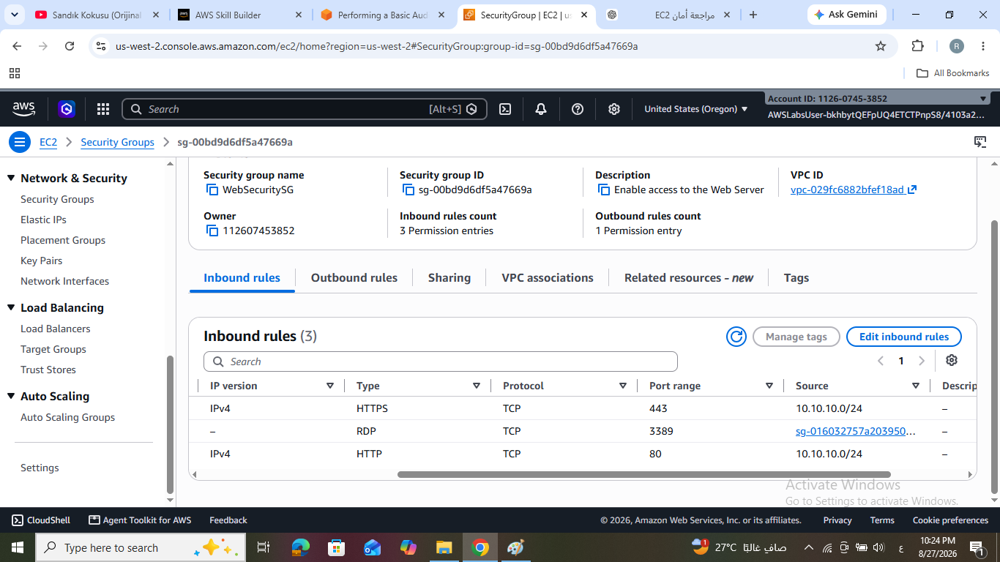

# AWS Basic Environment Audit

## 📌 Overview

This project demonstrates a hands-on security and configuration audit of an AWS environment using the AWS Management Console.

The audit focuses on reviewing **Identity and Access Management, EC2 security configurations, VPC network controls, CloudWatch monitoring, and CloudTrail logging**.

The objective was to inspect the AWS environment, verify access controls and security configurations, and collect screenshots as audit evidence.

---

## 🎯 Objectives

* Review IAM user permissions and group assignments.
* Validate permissions using the IAM Policy Simulator.
* Audit EC2 Security Group inbound and outbound rules.
* Review VPC and Network ACL configurations.
* Inspect CloudWatch metrics and EBS monitoring data.
* Review CloudTrail configuration and raw audit logs.
* Collect visual evidence to support the audit findings.

---

## 🛠️ AWS Services Used

| Service                  | Purpose                                             |
| ------------------------ | --------------------------------------------------- |
| **AWS IAM**              | Review users, groups, and permissions               |
| **IAM Policy Simulator** | Validate effective permissions                      |
| **Amazon EC2**           | Review running instances and security configuration |
| **Security Groups**      | Audit inbound and outbound network access           |
| **Amazon VPC**           | Review VPC and network security configuration       |
| **Network ACLs**         | Review subnet-level traffic controls                |
| **Amazon CloudWatch**    | Review metrics and monitoring data                  |
| **AWS CloudTrail**       | Review account activity and audit logs              |
| **Amazon S3**            | Review CloudTrail log storage                       |

---

# 🔐 Task 1 — IAM Permissions Audit

The IAM configuration was reviewed to determine the permissions assigned to `user-1`, including security credentials, group membership, and attached policies.

### IAM User Security Credentials

The security credentials associated with `user-1` were reviewed, including access keys, console access, and MFA configuration.


### IAM Group and Permissions

The group associated with `user-1` and its permissions were reviewed to understand how access was granted.


### IAM Policy Simulator

The IAM Policy Simulator was used to test whether `user-1` could perform administrative IAM actions.

The tested actions were:

* `DeleteGroup`
* `DeleteRolePolicy`

Both actions were **denied**, which is consistent with the read-only permissions assigned to the user.


### Audit Observation

The IAM configuration demonstrates the **principle of least privilege**, where the user has read-only access and cannot perform destructive IAM operations.

---

# 🖥️ Task 2 — EC2 Security Configuration Audit

Three EC2 instances were reviewed:

* Web Server
* Bastion Host
* SQL Server

Security Groups were inspected to evaluate inbound and outbound traffic controls.

## Web Server Security Group

The `WebServerSG` configuration was reviewed to verify restricted access to the web server.



### Audit Observation

Web traffic is restricted to a specific network range, while administrative RDP access is controlled through the Bastion security group.

This configuration reduces unnecessary exposure and follows the principle of **least privilege**.

---

## Bastion Host Security Group

### Inbound Rules


### Outbound Rules


### Audit Observation

The Bastion Host provides a controlled entry point for administrative access rather than exposing internal servers directly.

---

## SQL Server Security Group

### Inbound Rules


### Outbound Rules


### Audit Observation

The SQL Server is isolated from direct external access and relies on security-group-based communication controls.

This provides an additional layer of protection for database resources.

---

# 🌐 Task 3 — VPC Security Configuration Audit

The VPC configuration was reviewed to verify network-level security controls.

The audit included the Network ACL associated with the Lab VPC.

## Network ACL Inbound Rules


## Network ACL Outbound Rules


### Audit Observation

Network ACL rules were reviewed as an additional subnet-level security control alongside EC2 Security Groups.

The configuration provides explicit control over inbound and outbound network traffic.

---

# 📊 Task 4 — CloudWatch Monitoring Audit

Amazon CloudWatch metrics were reviewed to evaluate the monitoring capabilities available for the EC2 environment.

## SQL Server CPU Utilization

The CPU utilization metric for the SQL Server instance was reviewed through CloudWatch.


## Web Server EBS Volume Monitoring

The monitoring data for the EBS volume attached to the Web Server was reviewed.


### Audit Observation

CloudWatch provides operational visibility into EC2 and EBS resources and can be used to support monitoring, troubleshooting, and audit activities.

---

# 📝 Task 5 — CloudTrail Audit

AWS CloudTrail was reviewed to verify that account activity was being recorded and stored for auditing purposes.

## CloudTrail Trail Configuration

The `LabCloudTrail` trail configuration was reviewed, including its logging destination.


## CloudTrail Log Storage

The S3 bucket used to store CloudTrail logs was reviewed.


## Raw CloudTrail JSON Log

A raw CloudTrail log file was opened to review the recorded event data in JSON format.


### Audit Observation

CloudTrail provides an audit trail of AWS account activity and supports security investigations, operational auditing, and compliance activities.

---

# 🔎 Key Audit Findings

| Area             | Finding                                                               |
| ---------------- | --------------------------------------------------------------------- |
| **IAM**          | `user-1` has read-only access and destructive IAM actions were denied |
| **EC2 Security** | Security Groups restrict access between application tiers             |
| **Bastion Host** | Administrative access is controlled through a dedicated Bastion Host  |
| **SQL Server**   | Database access is isolated through Security Group rules              |
| **VPC**          | Network ACLs provide subnet-level traffic control                     |
| **CloudWatch**   | EC2 and EBS monitoring data is available                              |
| **CloudTrail**   | Account activity is logged and stored in Amazon S3                    |

---

# 📸 Audit Evidence

The screenshots included in this repository provide visual evidence collected during the AWS audit.

All evidence is organized under the:

```text
screenshots/
```

directory.

---

# 🧠 Skills Demonstrated

* AWS IAM permission auditing
* IAM Policy Simulator
* Identity and access management
* Principle of least privilege
* EC2 security assessment
* Security Group analysis
* Bastion Host architecture
* VPC security auditing
* Network ACL analysis
* CloudWatch monitoring
* CloudTrail auditing
* S3 log storage
* Security and compliance fundamentals
* Audit evidence collection

---

# 🏁 Conclusion

This hands-on audit provided practical experience in reviewing and validating the security posture of an AWS environment.

The audit covered **identity and access management, network security, resource isolation, monitoring, and logging**, demonstrating how AWS-native services can be used to support security auditing and operational governance.

The collected screenshots serve as supporting evidence for the configuration and access-control reviews performed throughout the lab.
